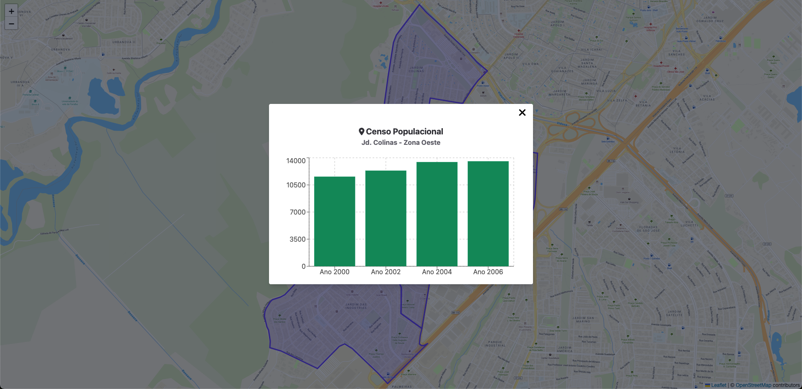
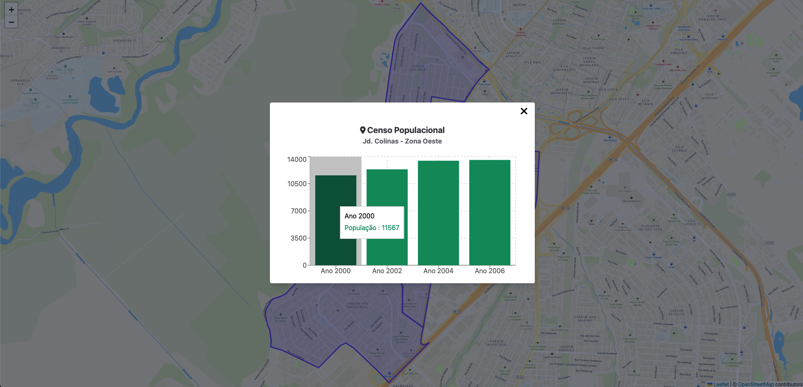

# Censo Populacional
<p align="center">
  
</p>

### Objetivo
Este projeto visa em mostrar a quantidade de pessoas que moravam em determinado bairro em 4 anos diferentes.
<br>

### Utilização
- Clique no bairro desejado
- Caso queira saber obter informações sobre o número exato, coloque o mouse em cima de um determinado ano.

### Projeto final




### Como rodar o projeto
<br>

- Rodar o projeto:
```sh
npm run dev
```

- Rodar os testes unitários:
```sh
npm run test
```

- Rodar os testes E2E
```sh
npm run teste2e
```

